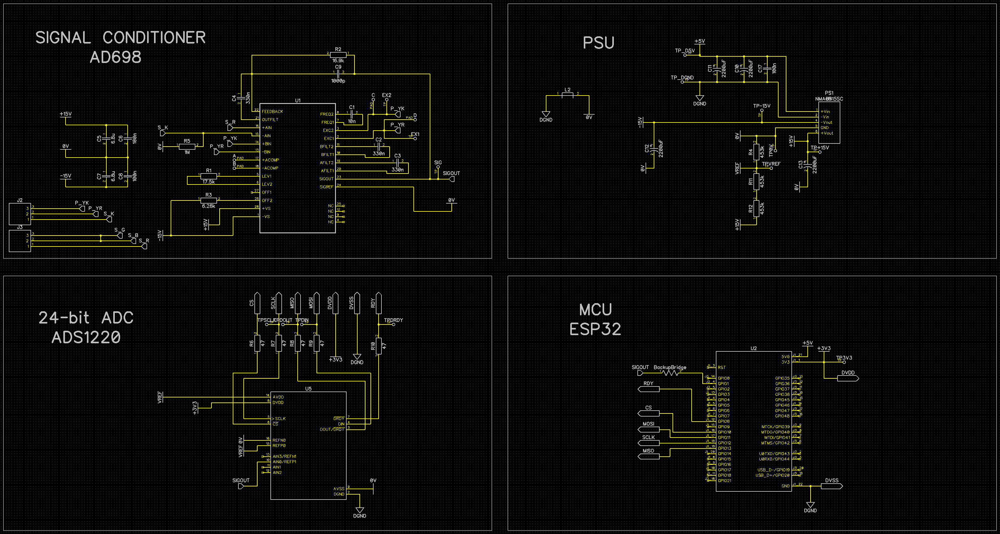

# HighPrecisionLVDT
This project is created during Praktikum Raumfahrtelektronik - Lehrstuhl für Raumfahrttechnik at the Technische Universität München (TUM).
This board carries out submillimeter measurement of an actuator displacement, which is part of a test-setup to transport Regolith via hoppers.
As a sensing unit an LVDT is used, that is driven by a Signal Conditioner which gets read by a 24-bit ADC to a MCU where the Experiment data is then delivered via WiFi.

Contributors: [Beatriz Mas Sanz](https://github.com/beatrizmassanz), [Thilo Witzel](https://github.com/TheWisator) and [Sven Julius Steinert](https://github.com/Sven-J-Steinert)

# General Schematic

# Partlist

|QTY|	DESCRIPTION	|PART NAME| PRICE | URL | 
| :---   | :---   | :---   | :---   | :---   |
|1|	LVDT Displacement Sensor |	Placeholder | 156€ |	[Mouser](https://www.mouser.de/ProductDetail/Measurement-Specialties/02560389-000?qs=%252BgKeJhng5iU0wv8eGISM%252BA%3D%3D) |
|1|	Microcontrollerboard |	ESP32-S3-DevKitC-1-N32R8V | 18€ | [Mouser](https://www.mouser.de/ProductDetail/Espressif-Systems/ESP32-S3-DevKitC-1-N32R8V?qs=Li%252BoUPsLEnvTvWIWLPCZ4g%3D%3D) [Doc](https://docs.espressif.com/projects/esp-idf/en/latest/esp32s3/hw-reference/esp32s3/user-guide-devkitc-1.html)|
|1|	24-bit ADC | ADS1220IPWR  | 10€ | [LCSC](https://www.lcsc.com/product-detail/Analog-To-Digital-Converters-ADCs_Texas-Instruments-ADS1220IPWR_C48263.html) [DE](https://www.exp-tech.de/9105/olimex-bb-ads1220)	[Mouser](https://www.mouser.de/ProductDetail/Texas-Instruments/ADS1220IPWR?qs=5GI1giJCN%252BI6s%2FWJGbZXXQ%3D%3D) [Lib](https://wolles-elektronikkiste.de/ads1220-4-kanal-24-bit-a-d-wandler) |
|1|	LVDT Signal Conditioner | AD698  | 54€  |	[Mouser](https://www.mouser.de/ProductDetail/Analog-Devices/AD698APZ?qs=NmRFExCfTkEHAhvFCYrQIg%3D%3D) |
|1|	PSU | 1W +15/-15V  | 5,08 €  |	[Mouser](https://www.mouser.de/ProductDetail/Murata-Power-Solutions/NMA0512SC?qs=J6Z1PhGvUbzUsAajU0vuCg%3D%3D) [Reichelt](https://www.reichelt.de/dc-dc-wandler-nma-1-w-15-v-33-ma-sil-dual-nma0515sc-p140635.html?&nbc=1) |
|4|	Capacitor | 16V  2200 µF  | 1,89€  |	[Mouser](https://www.mouser.de/ProductDetail/EPCOS-TDK/B41888C4228M000?qs=nadT%2FcWsIvC%2FjwByKwT1Sw%3D%3D) [Reichelt](https://www.reichelt.de/elko-radial-2200-f-16-v-105-low-esr-12-5x25-mm-rm-5-rad-lxz-16-2k2-p166372.html?&nbc=1) |
